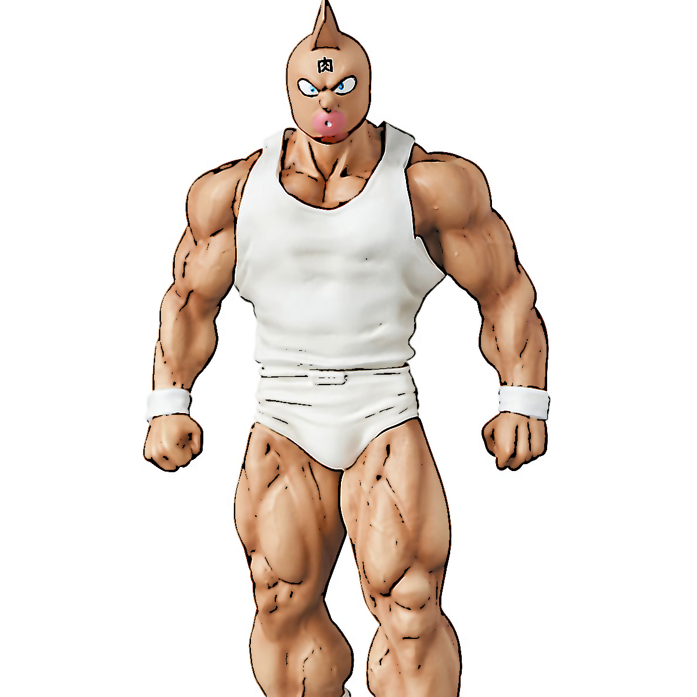
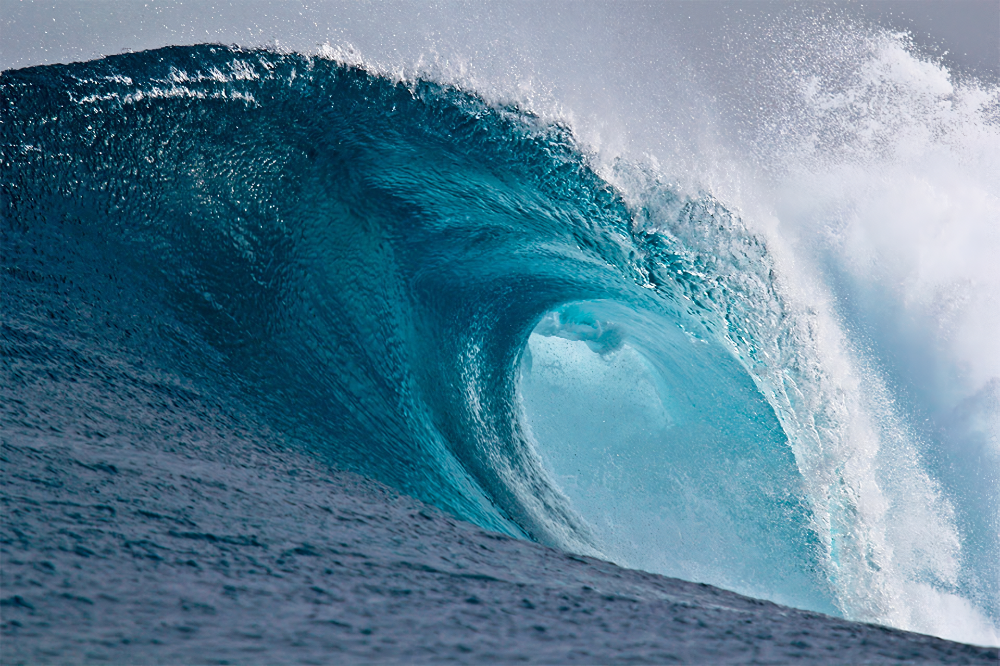

[ 프로젝트 소개 ]
이 프로젝트는 OpenCV를 활용하여 이미지를 애니메이션 스타일로 변환하는 필터를 구현한 것입니다.
입력된 사진의 외곽선을 강조하고, 색상을 부드럽게 처리하여 마치 애니메이션 장면처럼 보이도록 합니다.

--------------------------------------------------
[ 파일 구조 ]
프로젝트 폴더
cv_hw2.py           : 필터 적용 코드
README.md           : 프로젝트 설명z
image_statue.png    : 원본 이미지 1 (성공한 이미지)
output_statue.png   : 변환된 이미지 1 (실패한 이미지)
image_wave.png      : 원본 이미지 2 (성공한 이미지)
output_wave.png     : 변환된 이미지 2 (실패한 이미지)

--------------------------------------------------
[ 실행 방법 ]
1. OpenCV 및 NumPy 설치
   pip install opencv-python numpy

2. Python 스크립트 실행
   python cartoon_filter.py

--------------------------------------------------
[ 변환 전후 이미지 ]
(1) image_statue.png  →  output_statue.png
| 원본 이미지 | 변환 (성공) |
|------------|--------------|
|  |  |

(2) image_wave.png  →  output_wave.png
| 원본 이미지 | 변환 (실패) |
|------------|--------------|
|  |  |

각 원본 이미지는 애니메이션 스타일로 변환됩니다.
변환 과정에서는 외곽선을 강조하고, 색상을 부드럽게 처리하는 필터가 적용됩니다.

--------------------------------------------------
[ 코드 설명 (cartoon_filter.py) ]
1. 파일 목록을 설정하여 여러 개의 이미지를 처리하도록 구성
2. 이미지 불러오기 및 그레이스케일 변환
3. Median Blur 적용 (노이즈 제거)
4. Adaptive Threshold 적용 (외곽선 강조)
5. Dilation(팽창) 연산으로 외곽선 두껍게 만들기
6. Bilateral Filter 적용 (색상을 부드럽게 유지)
7. Sharpening Filter 적용 (이미지를 선명하게 변환)
8. 색상과 외곽선을 결합하여 최종 변환 이미지 생성
9. 결과 이미지 저장

--------------------------------------------------
[ 기대 효과 ]
- 원본 이미지보다 선이 더욱 뚜렷하고, 색상이 부드러운 애니메이션 스타일로 변환됩니다.
- 여러 필터를 조합하여 경계선을 강조하고, 색상을 단순화하는 효과를 얻을 수 있습니다.

--------------------------------------------------
[ 문의 및 개선점 ]
더 나은 개선 방법이나 질문이 있다면 GitHub Issues 또는 개발자에게 문의하세요!
